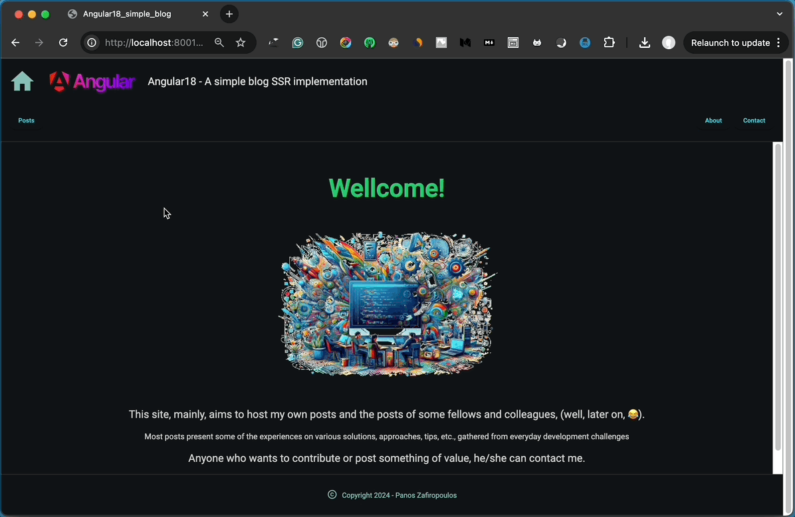

## ang18-SSR-SEO-SupportBlog1 
# Integrate Server-Side Rendering (SSR) into your existing Angular blog site project 

 

### A sample Angular project for Server-Side-Rendering (SSR) for your blog site.

This repo is actually a sequel of the previous repo:
* [Use URL Slugs for your Angular SPA blog website](https://github.com/zzpzaf/ang18SlugSupportBlog1)

The project uses as **backend**, the project: [blogbackdemo3](https://github.com/zzpzaf/blogbackdemo3)

Read more at my post: 
# "Integrate Server-Side Rendering (SSR) into your existing Angular blog site project"
* **[Medium](https://medium.com/@zzpzaf.se)**
* **[DevXperiences](https://www.devxperiences.com/developers-posts/)** 

---