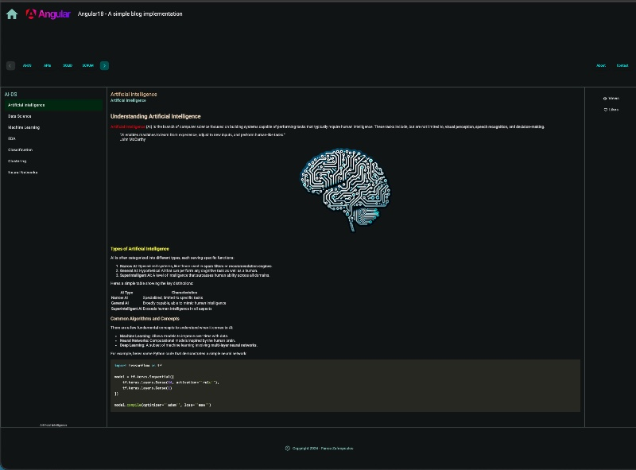

## ang18-SSR-SEO-SupportBlog1 
# Angular: Managing URL Slugs for your blog site 

 

### A sample Angular project for Server-Side-Rendering (SSR) and Search Engine Optimization (SEO) for your blog site.

<!--  -->

This repo is actually a sequel of the previous repo:
* [Use URL Slugs for your Angular SPA blog website](https://github.com/zzpzaf/ang18SlugSupportBlog1)

The project uses as **backend**, the project: [blogbackdemo4](https://github.com/zzpzaf/blogbackdemo4)

Read more at my post: 
# "Server-Side-Rendering (SSR) and Search Engine Optimization (SEO) for your Angular blog site"
* **[Medium](https://medium.com/@zzpzaf.se)**
* **[DevXperiences](https://www.devxperiences.com/developers-posts/)** 

---